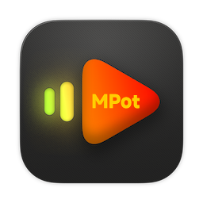

# MacPotPlayer

<p align="center">
  
</p>

<p align="center">
  <strong>一款功能完整的 macOS 视频播放器，对标 PotPlayer 的全部功能。</strong>
</p>

<p align="center">
  基于 <strong>Swift + AVFoundation + FFmpeg + Metal + libass</strong> 构建，原生 macOS 体验。
</p>

<p align="center">
  
  
  
</p>

---

## ✨ 功能特性

### 🎬 视频播放
- 支持几乎所有格式：MKV、MP4、AVI、MOV、FLV、WebM、HEVC/H.265、AV1、RMVB...
- VideoToolbox 硬件加速解码（支持 M1/M2/M3 芯片）
- Metal GPU 渲染，支持 ProMotion 120fps
- 网络流媒体：HTTP、HTTPS、RTSP、RTMP、HLS
- DVD / 蓝光目录播放

### 🎨 画面控制
- 多种画面比例：原始 / 适应 / 填充 / 4:3 / 16:9 / 21:9...
- 亮度、对比度、饱和度实时调节
- Metal 着色器滤镜（色彩空间转换）
- 翻转、旋转画面
- 画中画（PiP）

### 📝 字幕
- 外挂字幕：SRT、ASS/SSA、VTT、SUB、MicroDVD
- 内嵌字幕轨道（MKV 等容器）
- libass 渲染高质量 ASS 字幕
- 自动匹配同名字幕文件
- 字幕延迟调节、字号调节、位置调节

### 🎵 音频
- 10 段图形均衡器 + 10+ 预设
- 变速不变调（0.1x ~ 16x）
- 音量放大（最高 200%）
- 音量标准化（响度均衡）
- Core Audio 输出

### 📋 播放列表
- 多文件列表管理
- 随机播放、循环模式（单曲/列表）
- 拖拽排序、搜索过滤
- M3U 导入导出
- 最近文件记录

### 🔖 书签
- 添加/删除/重命名书签
- 一键跳转到书签位置
- 按媒体文件分组管理

### ⏱️ AB 循环
- 自由设置 A、B 两点循环播放

### 📸 截图
- 单张截图 / 连续截图
- 支持 PNG / JPEG / BMP 格式
- 自定义保存目录

### ⌨️ 快捷键
| 功能 | 快捷键 |
|------|--------|
| 播放/暂停 | `空格` |
| 全屏 | `⌘F` |
| 快进 5 秒 | `→` |
| 快退 5 秒 | `←` |
| 快进 1 分钟 | `⌘→` |
| 快退 1 分钟 | `⌘←` |
| 音量增加 | `↑` |
| 音量减少 | `↓` |
| 截图 | `⌘S` |
| 打开文件 | `⌘O` |
| 打开 URL | `⌘U` |
| 播放列表 | `⌘L` |

### 🖱️ 触摸板手势
- 双指上下滑动：调节音量
- 双指捏合：调整画面大小
- 双击：切换全屏

### 🌐 360° VR 全景视频
- 自动检测全景视频（元数据/文件名/2:1 宽高比）
- Metal 球面投影渲染，沉浸式体验
- 鼠标拖拽 / 滚轮 / 触摸板捏合控制视角
- 支持 FOV 缩放（30°~120°）
- HUD 实时显示视角参数

---

## 📁 项目结构

```
MacPotPlayer/
├── Sources/
│   ├── App/
│   │   ├── MacPotPlayerApp.swift      # App 入口
│   │   ├── AppDelegate.swift          # 应用委托
│   │   └── MacPotPlayerCommands.swift # 菜单命令
│   ├── Player/
│   │   ├── Engine/
│   │   │   ├── PlayerManager.swift    # 核心播放器管理器
│   │   │   ├── FFmpegPlayer.swift     # FFmpeg 播放器封装
│   │   │   └── VRCameraController.swift  # 360° 视角控制器
│   │   ├── Views/
│   │   │   ├── ContentView.swift      # 主界面
│   │   │   ├── VideoPlayerView.swift  # 视频渲染容器（含 VR 切换）
│   │   │   ├── VRPlayerView.swift     # 360° 球面 Metal 渲染器
│   │   │   ├── VideoAdjustmentsView.swift  # 画面调节
│   │   │   └── OpenURLView.swift      # URL 打开面板
│   │   └── Controls/
│   │       └── PlayerControlsView.swift    # 播放控制栏
│   ├── Subtitles/
│   │   ├── SubtitleManager.swift      # 字幕管理器（SRT/ASS/VTT 解析）
│   │   └── SubtitleOverlayView.swift  # 字幕渲染层
│   ├── Playlist/
│   │   ├── PlaylistManager.swift      # 播放列表逻辑
│   │   ├── PlaylistSidebarView.swift  # 播放列表 UI
│   │   ├── BookmarkManager.swift      # 书签管理
│   │   └── BookmarkPanelView.swift    # 书签 UI
│   ├── Audio/
│   │   ├── AudioProcessingEngine.swift # AVAudioEngine + 均衡器
│   │   └── EqualizerView.swift         # 均衡器 UI
│   ├── Capture/
│   │   └── ScreenshotManager.swift    # 截图管理
│   ├── Preferences/
│   │   ├── PreferencesManager.swift   # 设置管理器
│   │   └── PreferencesView.swift      # 设置界面
│   └── Utils/
│       ├── SupportedFormats.swift     # 支持的文件格式
│       ├── PlaybackProgressStore.swift # 播放进度持久化
│       ├── MediaKeyHandler.swift      # 媒体键监听
│       └── Logger.swift               # 日志 & 通知
├── Bridging/
│   ├── MacPotPlayer-Bridging-Header.h # Swift-ObjC 桥接头
│   ├── FFmpegBridge.h / .mm           # FFmpeg Objective-C++ 封装
│   └── ASSBridge.h / .mm              # libass Objective-C++ 封装
├── Resources/
│   ├── Info.plist                     # App 配置
│   ├── MacPotPlayer.entitlements      # 权限声明
│   └── Assets.xcassets/              # 图标资源
├── Scripts/
│   ├── setup_dependencies.sh         # 依赖安装脚本
│   └── build_dmg.sh                  # DMG 打包脚本
├── project.yml                       # XcodeGen 项目配置
└── Package.swift                     # SPM 配置
```

---

## 🤖 GitHub Actions 自动构建

push 代码后自动在 macOS 14 (Apple Silicon) 上构建，无需 Mac 也能出 `.app` / `.dmg`。

### 工作流说明

| Workflow | 触发条件 | 产物 |
|----------|---------|------|
| `build.yml` | push / PR | `.app` (zip，保留 7 天) |
| `release.yml` | push tag `v*.*.*` | `.dmg` + GitHub Release |

### 发布新版本

```bash
# 1. 提交并打标签
git add .
git commit -m "Release v1.0.0"
git tag v1.0.0
git push origin main --tags

# 2. GitHub Actions 自动触发
#    → 构建 Release 版本
#    → 打包 .dmg
#    → 创建 GitHub Release（含下载链接）
```

### 下载 .app（无需发布）

1. 打开 GitHub 仓库页面 → **Actions** → **Build** workflow
2. 选择最新的 run → **Artifacts** → 下载 `MacPotPlayer-Build`

### 本地打包 DMG（在 Mac 上）

```bash
chmod +x Scripts/build_dmg.sh
./Scripts/build_dmg.sh 1.0.0
# 输出: dist/MacPotPlayer_1.0.0_macOS.dmg
```

---

## 🚀 快速开始

### 环境要求
- macOS 14.0+ (Sonoma)
- Xcode 15.3+
- Homebrew

### 1. 安装依赖（仅首次）

```bash
chmod +x Scripts/setup_dependencies.sh
./Scripts/setup_dependencies.sh
```

### 2. 生成 Xcode 项目

```bash
brew install xcodegen
xcodegen generate
```

### 3. 打开并构建

```bash
open MacPotPlayer.xcodeproj
```
在 Xcode 中选择 Mac 目标，点击 ▶ 运行。

---

## 🛠️ 技术架构

```
┌─────────────────────────────────────────────────┐
│                   SwiftUI / AppKit               │  UI 层
├─────────────────────────────────────────────────┤
│  PlayerManager  │  PlaylistManager  │  SubtitleMgr│  业务层
├─────────────────────────────────────────────────┤
│   FFmpegPlayer  │  AudioProcessing  │  Screenshot │  功能层
├──────────────┬──────────────────────────────────┤
│  Metal (GPU) │       AVAudioEngine              │  渲染层
├──────────────┴──────────────────────────────────┤
│  FFmpegBridge (ObjC++)  │  ASSBridge (ObjC++)   │  桥接层
├─────────────────────────────────────────────────┤
│  FFmpeg C API           │  libass C API          │  底层库
└─────────────────────────────────────────────────┘
```

---

## 📄 开源许可

本项目基于 MIT License 开源。

FFmpeg 遵循 LGPL/GPL 协议，libass 遵循 ISC 协议。
